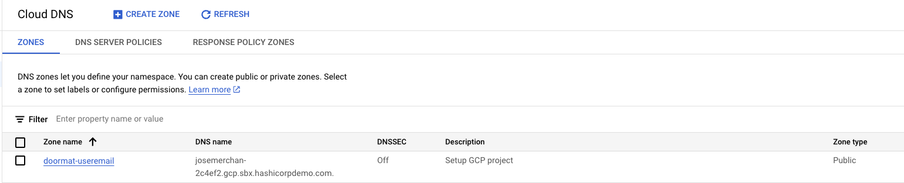
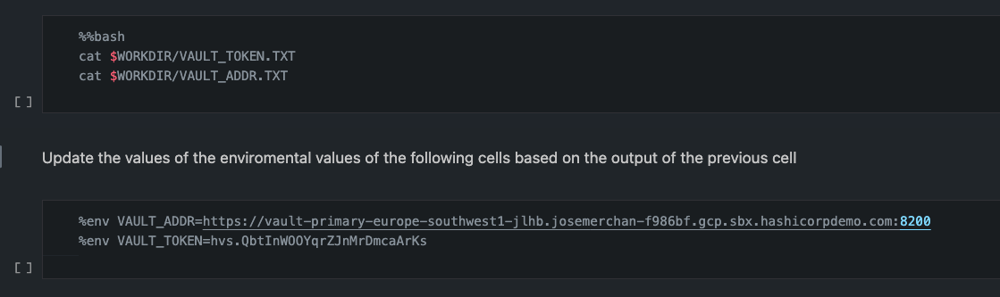

# Prerequisite

* A GCP Account
* The Zone name of a Public Zone in the GCP Account used to deploy the infrastructure.
* Make sure to enable the [KMS Service API ](https://cloudkms.googleapis.com)beforehand so we don't hit replication issues.



# 1. Platform Deployment

## 1.1. Create kubernetes clusters and install Vault via helm.

```bash
gcloud auth application-default login 
gcloud auth login
cd 1_Platform_Deployment
terraform init
terraform apply -auto-approve -var-file=variables.tfvars
```

## 1.2. Inputs

Create a variables.tfvars file using the following inputs

| variable          | Value                  | Type   | Description                                                          |
| ----------------- | ---------------------- | ------ | -------------------------------------------------------------------- |
| project_id        | "efesreadfeasfsfsfdfd" | string | Your GCP project id                                                  |
| dns_zone_name_ext | "dns-zone"             | string | The Public DNS Zone Created in your Project                          |
| vault_version     | "1.18.1"               | string | The Vault version to use                                             |
| vault_enterprise  | true                   | bool   | Whether to use Vault Enterprise or CE                                |
| vault_license     | "04CV3U....C7T"        | string | The vault enterprise license                                         |
| email             | "user@domain.com"      | string | The email address of the person used to create the ACME certificates |

## 1.3. Initialize Vault

Run the Jupyter Notebook `bootstrap.ipynb` to initialize the three clusters, where one will work as primary cluster, another as performance secondary and finally a DR cluster for the primary one.

## 1.4. Build DR and PR

* Run the notebook `dr.ipynb` to set the Disaster Recovery relationship.
* Run the notebook `pr.ipynb` to build the Performance Replication relationship.

Note that after running both notebooks, all instances with the exception of the leader node on the DR and PR cluster will seal, so you have to reload those PODs so the cluster unseals properly.

## 1.5 Export Vault Token and Address

```bash
export VAULT_ADDR=$(terraform output -raw cluster_primary_fqdn_8200)
vault_token_primary=$(terraform output -raw cluster_primary_read_vault_token)
# Execute the command stored in $vault_token
export VAULT_TOKEN=$(eval "$vault_token_primary")
```

## 1.6 Connect to Kubernetes cluster

In the same fashion as Vault address and token that can be obtained based on commands outlined as terrafom

```bash
eval $(terraform output -raw configure_kubectl_cluster_primary)
```

# 2. User Access

## 2.1. Prerequisite

We are going to use Auth0 for user access, as well as LDAP. The LDAP server will be installed as POD in the Kuberentes environment and initialize with an ldif file as a post-installation step. To access Auth0 we need to export the following data as environmental variable.

```bash
export AUTH0_DOMAIN=************.us.auth0.com
export AUTH0_CLIENT_ID=********
export AUTH0_CLIENT_SECRET=***
```

This information will be used by the Auth0 provider to authenticate against Auth0

## 2.2. Create IdP

```bash
cd ../2_User_Acess/
terraform init
terraform apply -auto-approve -var-file=variables.tfvars
```

## 2.3. Inputs

Create a variables.tfvars file using the following inputs

| variable       | Value                 | Type   | Description                                            |
| -------------- | --------------------- | ------ | ------------------------------------------------------ |
| auth0_password | i.e.: "SuperPassw0rd" | string | The password that will be used for LDAP user and Auth0 |

## 2.4. Configure LDAP

```bash
eval $(terraform output -raw ldap_config)
```

## 2.5. Test Access

```bash
vault login -method=oidc role="admin"
```

Next log with user `peter@vaultproject.io` and the password defined as variable. Below you can see an example of login using the cli (a browser window will be open)

```bash
> vault login -method=oidc role="admin"
Complete the login via your OIDC provider. Launching browser to:

    https://dev-q6ml3431eugrpfdc.us.auth0.com/authorize?client_id=I51KNmS5mx3HXrwWVda82yL7HCZ0XGWm&code_challenge=nyDF4rScGX7ZnlwERLNwtO3K3hBolwGUGHbN9kIY0TA&code_challenge_method=S256&nonce=n_mQxDcaWlS79pRak7XdmJ&redirect_uri=http%3A%2F%2Flocalhost%3A8250%2Foidc%2Fcallback&response_type=code&scope=openid&state=st_SjwL11IggYI48xnR6SFh


Waiting for OIDC authentication to complete...
WARNING! The VAULT_TOKEN environment variable is set! The value of this
variable will take precedence; if this is unwanted please unset VAULT_TOKEN or
update its value accordingly.

Success! You are now authenticated. The token information displayed below
is already stored in the token helper. You do NOT need to run "vault login"
again. Future Vault requests will automatically use this token.

Key                  Value
---                  -----
token                hvs.CAESIIyMq2BPr78j6Uux6fptbl7kbuIQZBw6_7e1hAwqMxOCGiEKHGh2cy41aXBwR1IxRnBYR2NMVDJRTWR2QVNVbFUQnzA
token_accessor       fNQVk36Wp9OxY96bzEeLG2pQ
token_duration       12h
token_renewable      true
token_policies       ["default"]
identity_policies    ["admin"]
policies             ["admin" "default"]
token_meta_role      admin
```

Likewise you can login using LDAP Auth method

```bash
> vault login -method=ldap username=peter
Password (will be hidden): 
WARNING! The VAULT_TOKEN environment variable is set! The value of this
variable will take precedence; if this is unwanted please unset VAULT_TOKEN or
update its value accordingly.

Success! You are now authenticated. The token information displayed below
is already stored in the token helper. You do NOT need to run "vault login"
again. Future Vault requests will automatically use this token.

Key                    Value
---                    -----
token                  hvs.CAESIL4wxY_wY9CFTStaDMQZxBFanaSFEXRZ2wVaqpKSkq5-GiEKHGh2cy5pOUFhOFdFQ2lBMDlmVkN3cElqajBxRUYQ5zE
token_accessor         qW79lvrq22Ruo1Evyt7J9nlE
token_duration         768h
token_renewable        true
token_policies         ["admin" "default"]
identity_policies      ["admin"]
policies               ["admin" "default"]
token_meta_username    peter
```

We have created a second user (`alice`) that can login using both OIDC or LDAP, that unlike `peter` that has full admin access, has been associated to an audit role. Authenticating using LDAP for `alice`

```bash
> vault login -method=ldap username=alice
Password (will be hidden): 
WARNING! The VAULT_TOKEN environment variable is set! The value of this
variable will take precedence; if this is unwanted please unset VAULT_TOKEN or
update its value accordingly.

Success! You are now authenticated. The token information displayed below
is already stored in the token helper. You do NOT need to run "vault login"
again. Future Vault requests will automatically use this token.

Key                    Value
---                    -----
token                  hvs.CAESII0zuXPrxWKrJn-S4iLF-UP1Rp5zNSe-95lS3nTytHXwGiEKHGh2cy5Pbnd0ZzlnSlBvcGJ5UXRMUXF2RElIZ1gQ8zI
token_accessor         LYSCMF6tcPYPfEUlfnOjcz7o
token_duration         768h
token_renewable        true
token_policies         ["audit" "default"]
identity_policies      ["audit"]
policies               ["audit" "default"]
token_meta_username    alice
```

# 3. Static Secrets, Secret Sync and Kubernetes examples

In this folder we have 3 different workflows:

1. A Jupyter Notebook `3.1_KV Secret Engine.ipynb` to create a Static Secret engine KVv2. The Vault address and Token and read from file, files created on a previous cell.

2. Terraform code to build a second KV secret engine that will be integrated with GCP Secrets, by means of Secret Sync functionality. The last two cells of the previous notebooks can be used to run this terraform code.
   * Create a .tfvars file and provide a value for the variable `project_id`.
3. A second Jupyter Notebook (`3.3_VSO.ipynb`) that we will use to deploy workloads in K8S and integrate with Vault via Vault Secret Operator (VSO).
   * Like in the first notebook, we need to update the VAULT_ADDR and VAULT_TOKEN enviromental variables.
   * The notebook covers the case for static, dynamic and certificates, so we will revisit this notebook as we progress.

# 4. Dynamic Secrets
This folder contains three Jupyter Notebook.
1. Database Secret Engine (`4.1_Database_Secret_Engine.ipynb`). We will be deploying a postgres database in Kubernetes. The Secret Engine will be configured as `local`, which means it will not be replicated to the Performance Replication cluster. For this database we are going to use `Dynamic Roles`.
2. LDAP Secret Engine (`4.2LDAP_Secret_Engine.ipynb`). Here we are leveraging the previously installed LDAP Database and make use of both `Static` and `Dynamic Roles`.
3. GCP Secret Engine (`4.3_GCP_Secret_Engine.ipynb`). We will use this notebook to run the `terraform` code in the folder. Like in the previous cases we need to create a .tfvars file and provide a value for the variable `project_id`.

If we go back to the Jupyter Notebook `3.3_VSO.ipynb` we have a couple of examples of how to integrate VSO with Kubernetes workshops via VSO.

# 5. Encryption platform with Transit
This folder contains a Jupyter Notebook that presents a few examples of:
* Encryption/Decryption
* Signing and Verification
* HMAC-ing and Verification
* Hashing

# 6. PKI

# 7. KMSE
This folder contains two Jupyter Notebook:
* `gcp_kmse.ipynb` shows how to sync keys with GCP.
* `aws_kmse.ipynb` shows how to sync keys with AWS.

# 8. KMIP

